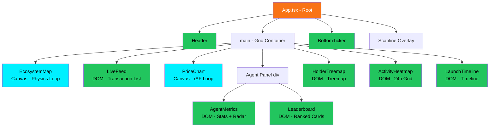
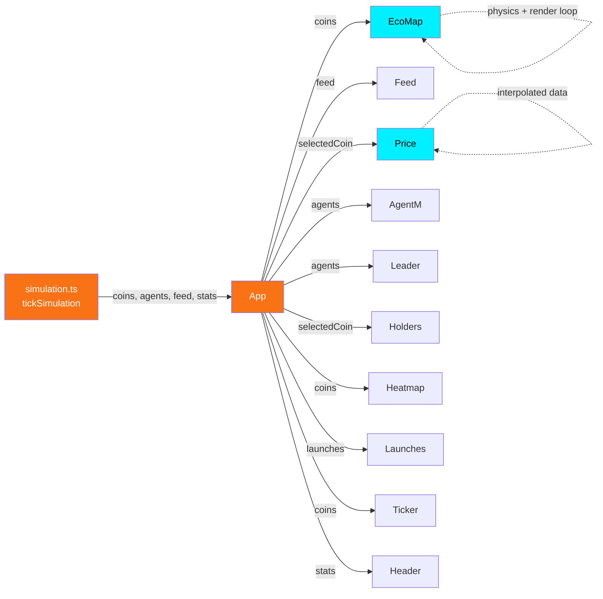
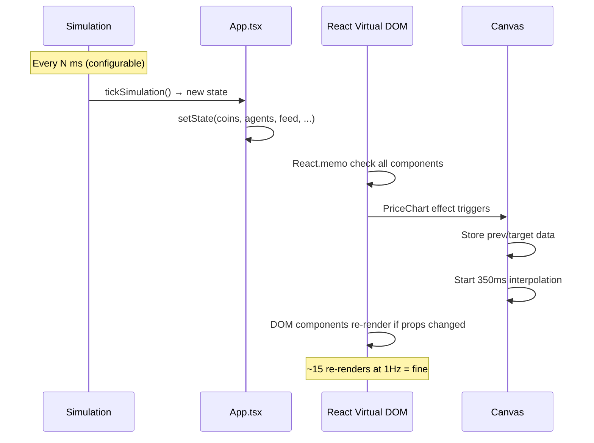
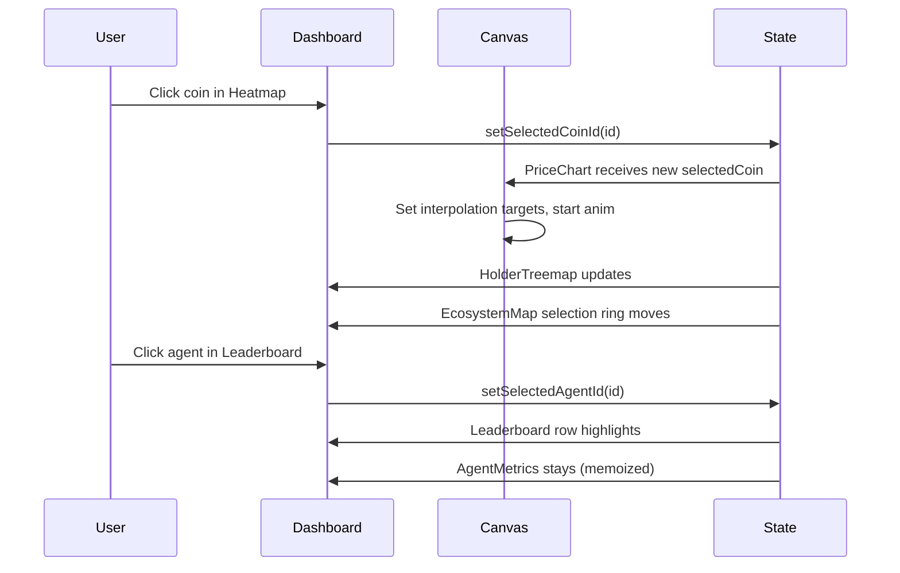
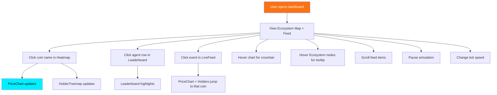

# Component Tree

```mermaid
graph TD
    App[App.tsx - Root]
    
    App --> Header[Header]
    App --> Main[main - Grid Container]
    App --> Ticker[BottomTicker]
    App --> Scanline[Scanline Overlay]
    
    Main --> EcoMap[EcosystemMap<br/>Canvas - Physics Loop]
    Main --> Feed[LiveFeed<br/>DOM - Transaction List]
    Main --> Price[PriceChart<br/>Canvas - rAF Loop]
    Main --> AgentPanel[Agent Panel div]
    Main --> Holders[HolderTreemap<br/>DOM - Treemap]
    Main --> Heatmap[ActivityHeatmap<br/>DOM - 24h Grid]
    Main --> Launches[LaunchTimeline<br/>DOM - Timeline]
    
    AgentPanel --> AgentM[AgentMetrics<br/>DOM - Stats + Radar]
    AgentPanel --> Leader[Leaderboard<br/>DOM - Ranked Cards]
    
    style App fill:#f97316,color:#fff
    style EcoMap fill:#00F0FF,color:#000
    style Price fill:#00F0FF,color:#000
    style Feed fill:#22c55e,color:#000
    style AgentM fill:#22c55e,color:#000
    style Leader fill:#22c55e,color:#000
    style Holders fill:#22c55e,color:#000
    style Heatmap fill:#22c55e,color:#000
    style Launches fill:#22c55e,color:#000
    style Ticker fill:#22c55e,color:#000
    style Header fill:#22c55e,color:#000
```

# Data Flow

```mermaid
graph LR
    Sim[simulation.ts<br/>tickSimulation] -->|coins, agents, feed, stats| App
    
    App -->|coins| EcoMap
    App -->|feed| Feed
    App -->|selectedCoin| Price
    App -->|agents| AgentM
    App -->|agents| Leader
    App -->|selectedCoin| Holders
    App -->|coins| Heatmap
    App -->|launches| Launches
    App -->|coins| Ticker
    App -->|stats| Header
    
    Price -.->|interpolated data| Price
    EcoMap -.->|physics + render loop| EcoMap
    
    style Sim fill:#f97316,color:#fff
    style App fill:#f97316,color:#fff
    style Price fill:#00F0FF,color:#000
    style EcoMap fill:#00F0FF,color:#000
```

# Render Lifecycle

```mermaid
sequenceDiagram
    participant S as Simulation
    participant A as App.tsx
    participant R as React Virtual DOM
    participant C as Canvas
    
    Note over S: Every N ms (configurable)
    S->>A: tickSimulation() → new state
    A->>A: setState(coins, agents, feed, ...)
    R->>R: React.memo check all components
    R->>C: PriceChart effect triggers
    C->>C: Store prev/target data
    C->>C: Start 350ms interpolation
    R->>R: DOM components re-render if props changed
    Note over R: ~15 re-renders at 1Hz = fine
```

# Event Flow

```mermaid
sequenceDiagram
    participant U as User
    participant D as Dashboard
    participant C as Canvas
    participant S as State
    
    U->>D: Click coin in Heatmap
    D->>S: setSelectedCoinId(id)
    S->>C: PriceChart receives new selectedCoin
    C->>C: Set interpolation targets, start anim
    S->>D: HolderTreemap updates
    S->>D: EcosystemMap selection ring moves
    
    U->>D: Click agent in Leaderboard
    D->>S: setSelectedAgentId(id)
    S->>D: Leaderboard row highlights
    S->>D: AgentMetrics stays (memoized)
```

# User Interaction Paths

```mermaid
graph TD
    Start[User opens dashboard]
    
    Start --> View[View Ecosystem Map + Feed]
    View --> Click1[Click coin name in Heatmap]
    View --> Click2[Click agent row in Leaderboard]
    View --> Click3[Click event in LiveFeed]
    View --> Hover1[Hover chart for crosshair]
    View --> Hover2[Hover Ecosystem nodes for tooltip]
    View --> Scroll[Scroll feed items]
    View --> Pause[Pause simulation]
    View --> Speed[Change tick speed]
    
    Click1 --> Chart[PriceChart updates]
    Click1 --> Holders[HolderTreemap updates]
    
    Click2 --> Leader[Leaderboard highlights]
    
    Click3 --> Jump[PriceChart + Holders jump to that coin]
    
    style Start fill:#f97316,color:#fff
    style Chart fill:#00F0FF,color:#000
```
